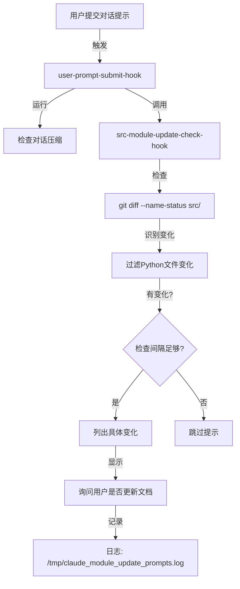

# Claude Code Hooks 配置指南

## 🎯 概述

本项目配置了自动化的 Hook 脚本，在特定事件触发时执行自定义逻辑。这些 Hook 帮助维护代码规范和项目文档的同步。

---

## 📦 已安装的 Hooks

### 1. **user-prompt-submit-hook** ⭐ 关键
- **触发时机**：用户提交对话提示时
- **功能**：
  - 检查对话是否被压缩，并提醒激活中文输出模式
  - 检测 `src/` 目录是否有代码变化
  - 如果有变化，提示用户是否需要更新模块文档

### 2. **src-module-update-check-hook** 🆕 新增
- **触发时机**：由 `user-prompt-submit-hook` 调用
- **功能**：
  - 扫描 `src/` 目录的文件变化（增/删/改）
  - 过滤无关的临时文件（`__pycache__`, `*.pyc` 等）
  - 列出所有 Python 代码变化
  - 向用户显示友好的提示，询问是否更新文档
  - 记录检查日志到 `/tmp/claude_module_update_prompts.log`

### 3. **file-output-rule-hook**
- **功能**：监控文件输出规则的遵守情况

### 4. **conversation-compacted-hook**
- **功能**：处理对话压缩事件

### 5. **thinking-display-hook**
- **功能**：控制思考过程的显示方式

---

## 🔧 使用指南

### 自动工作流

1. **你完成代码开发任务**
   ```
   用户: "在 src/services/ 中添加 Claude 集成服务"
   ```

2. **Hook 自动检测 src/ 变化**
   ```
   ✅ 任务已完成。检测到 src/ 目录发生了代码变化。
   ```

3. **Hook 显示变化详情**
   ```
   📋 **检测到的 src/ 目录变化：**

   ➕ **新增文件：**
      • src/services/claude_integration.py
      • src/api/claude_cache_routes.py

   ✏️  **修改文件：**
      • src/main.py
   ```

4. **Hook 提示用户更新文档**
   ```
   **是否需要更新 docs/guides/MODULE_OVERVIEW.md？**

   操作指南：
     • 若要立即更新文档，请运行：`/update-module-docs` 命令
     • 若要手动更新，请直接编辑文档：docs/guides/MODULE_OVERVIEW.md
     • 若要跳过此步，可忽略此提示
   ```

5. **用户选择操作**
   - **选项 A**：运行 `/update-module-docs` 自动更新文档
   - **选项 B**：手动编辑 `docs/guides/MODULE_OVERVIEW.md`
   - **选项 C**：现在跳过，稍后手动更新

---

## 📋 Hook 工作流程



---

## 📊 Hook 配置详情

### src-module-update-check-hook 参数

| 参数 | 值 | 说明 |
|------|-----|------|
| **PROJECT_ROOT** | `/mnt/d/工作区/云开发/working` | 项目根目录 |
| **MODULE_DOC** | `docs/guides/MODULE_OVERVIEW.md` | 模块文档路径 |
| **MIN_CHECK_INTERVAL** | 60 秒 | 最小检查间隔（防止频繁提示） |
| **PROMPT_HISTORY_FILE** | `/tmp/claude_module_update_prompts.log` | 日志文件 |

### 日志文件位置

```bash
# 查看 Hook 执行日志
cat /tmp/claude_module_update_prompts.log

# 日志格式示例：
# [2025-11-20 16:30:45] [INFO] 检查间隔太短（30s < 60s），跳过提示
# [2025-11-20 16:31:45] [PROMPT] 向用户显示了模块文档同步提示
```

---

## ⚙️ 自定义配置

### 修改检查间隔

编辑 `src-module-update-check-hook`，修改第 14 行：

```bash
# 原默认值：60 秒
MIN_CHECK_INTERVAL=60

# 改为 120 秒（减少频繁提示）
MIN_CHECK_INTERVAL=120
```

### 修改项目路径

如果项目移到其他位置，编辑第 8 行：

```bash
# 原路径
PROJECT_ROOT="/mnt/d/工作区/云开发/working"

# 改为新路径（例如）
PROJECT_ROOT="/home/user/my-project"
```

### 关闭特定 Hook

如果想临时禁用 src/ 检查，注释掉 `user-prompt-submit-hook` 中的调用：

```bash
# 注释掉这两行：
# HOOKS_DIR="$(cd "$(dirname "${BASH_SOURCE[0]}")" && pwd)"
# if [ -f "$HOOKS_DIR/src-module-update-check-hook" ]; then
#     bash "$HOOKS_DIR/src-module-update-check-hook"
# fi
```

---

## 🐛 排查和调试

### 检查 Hook 是否正常工作

```bash
# 手动运行 Hook（不依赖用户提示）
bash /mnt/d/工作区/云开发/working/.claude/hooks/src-module-update-check-hook

# 查看日志输出
tail -f /tmp/claude_module_update_prompts.log
```

### 验证 git 仓库状态

```bash
# 确保项目是 git 仓库
cd /mnt/d/工作区/云开发/working
git rev-parse --git-dir

# 查看 src/ 目录最近的变化
git diff --name-status HEAD src/
```

### 常见问题

| 问题 | 原因 | 解决方案 |
|------|------|--------|
| Hook 没有提示 | 检查间隔太短 | 等待至少 60 秒后再提交新任务 |
| Hook 没有提示 | src/ 没有 Python 文件变化 | 检查是否实际修改了 .py 文件 |
| Hook 错误 | 项目路径不正确 | 检查 PROJECT_ROOT 变量设置 |
| Hook 很慢 | git 仓库太大 | 这是正常的，git diff 需要时间 |

---

## 📝 最佳实践

### ✅ 推荐做法

1. **完成代码开发后，立即查看 Hook 提示**
   - Hook 会自动检测变化，无需手动操作

2. **及时更新模块文档**
   - 运行 `/update-module-docs` 或手动编辑
   - 保持文档与代码同步

3. **定期查看 Hook 日志**
   - 了解自动化工作流的执行情况
   - 调整检查间隔以适应工作节奏

### ❌ 避免做法

1. **忽视 Hook 提示**
   - 可能导致模块文档与代码不同步

2. **频繁提交小改动**
   - Hook 会在 60 秒内跳过提示，避免频繁骚扰

3. **修改 Hook 脚本后不测试**
   - 修改后应手动运行一次验证工作正常

---

## 🚀 快速命令参考

```bash
# 手动触发 Hook 检查
bash ~/.claude/hooks/src-module-update-check-hook

# 查看最近的 Hook 日志
tail -20 /tmp/claude_module_update_prompts.log

# 清理 Hook 日志
rm /tmp/claude_module_update_prompts.log

# 重置检查时间戳（强制下次立即提示）
rm /tmp/claude_last_src_check_time

# 验证所有 Hook 脚本都可执行
ls -la /mnt/d/工作区/云开发/working/.claude/hooks/
```

---

## 📚 相关文档

- [CLAUDE.md](../CLAUDE.md) - 项目工作流规则
- [MODULE_OVERVIEW.md](../docs/guides/MODULE_OVERVIEW.md) - 模块文档
- [config.json](./config.json) - Claude Code 配置

---

**最后更新**：2025-11-20
**Hook 版本**：2.0
**维护人**：Claude Code
